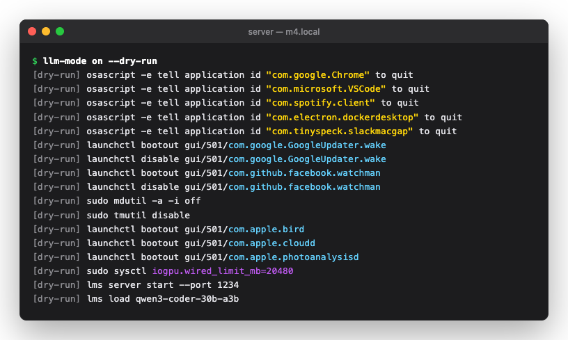
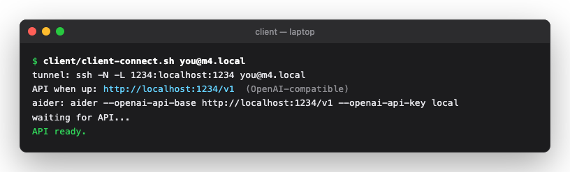

<div align="center">

# 🧠 llm-mode

**Turn a spare Mac into a local LLM coding server with one command, and get it back with another.**

Quits your apps, parks background services, raises the GPU memory limit, starts
LM Studio, and serves the model to your other Mac over an SSH tunnel.
`llm-mode off` puts everything back.


<!-- Read the story: [TITLE](MEDIUM_URL) -->

</div>

---

## Why

A 24 GB MacBook can run a 30B coding model, but only just. A 4-bit
`qwen3-coder-30b-a3b` needs about 17 GB of unified memory that the GPU can wire.
On a normal working day that memory is already taken by Chrome, Slack, Docker,
Spotlight indexing and a dozen updaters. macOS also caps how much memory the GPU
may wire, and on a machine this size the default cap is below what the model needs.

You can free all of that by hand: quit apps, `launchctl bootout` a few agents,
turn off Spotlight and Time Machine, `sysctl` the GPU limit, start the server,
load the model. Then you have to remember every step so you can undo it.

`llm-mode on` does all of that and writes down what it changed. `llm-mode off`
reads those notes back and undoes each step.

```
┌──────────── laptop ────────────┐           ┌────────── server Mac ──────────┐
│ Zed / Continue / Cline / aider │           │  llm-mode on                   │
│   → http://localhost:1234/v1   │── ssh -L ─│  LM Studio  → localhost:1234   │
└────────────────────────────────┘           └────────────────────────────────┘
```

## What it looks like

<div align="center">

</div>

> Run `--dry-run` first. It prints every command `on` would execute, so you can
> check what it plans to close before anything is closed.

<div align="center">

</div>

> On the laptop, one script opens the tunnel and waits until the API responds.
> Editors then use `localhost:1234` as if the model were running on the laptop.

There's also a menu bar app (`LLMMode.app`) with **ON / OFF / Refresh**, model
name, server up/down, free RAM and hostname. It runs the same CLI.

## What `on` does

| # | Step | How |
|---|------|-----|
| 1 | **Snapshot** | Running GUI apps, enabled user launch agents, current `iogpu.wired_limit_mb` go to `~/.llm-mode/state.json`, *before anything changes* |
| 2 | **Quit apps** | AppleScript `quit`, then `kill -9` for anything still alive after 10s |
| 3 | **Park agents** | `launchctl bootout` + `disable` user-installed agents (plist in `~/Library/LaunchAgents`) |
| 4 | **Pause services** | Spotlight (`mdutil -a -i off`), Time Machine (`tmutil disable`), `bird` / `cloudd` / `photoanalysisd` |
| 5 | **Raise GPU limit** | `sysctl iogpu.wired_limit_mb=<total RAM − 4 GB>` (20480 on a 24 GB machine); the reserve is configurable |
| 6 | **Serve** | `lms server start`, `lms load <model>`, then polls `/v1/models` until it responds |

`off` goes through `state.json` in reverse: stops the server, restores the old
wired limit, re-enables and restarts agents, turns Spotlight and Time Machine back
on, and with `--relaunch` reopens the apps it quit.

## Safety

The tool quits apps and disables system services, so most of the design is about
being able to undo that:

- **State is written before any change.** If `on` is interrupted halfway, `off`
  can still restore. If something is still wrong, a reboot resets it.
- **`on` never overwrites real state.** Running it twice keeps the first
  snapshot. To take a new one, run `off` and then `on`. The only state it replaces
  is a snapshot from `--dry-run`, which is tagged `"dry_run": true`.
- **Every restore step runs on its own.** If one step fails (for example `sudo`
  with no TTY when triggered from the menu bar), `off` logs it and continues. It
  prints `restored.` or `restored with N failed steps (see log)`.
- **It only disables agents it can re-enable.** That means agents with a plist in
  `~/Library/LaunchAgents`. Apple's own GUI agents are left alone. An early version
  did disable them and `off` couldn't bring them back.
- **sudo is limited to five commands.** `install.sh` grants `NOPASSWD` for exactly
  `sysctl iogpu.wired_limit_mb=*`, `mdutil -a -i off|on`, `tmutil disable|enable`.
  The grant is checked with `visudo -c -f` before it's copied into `/etc/sudoers.d/`.
- **The API is never exposed on the LAN.** LM Studio listens on localhost only. The
  client reaches it over SSH, so the only open port is port 22.

### Whitelist

`on` never touches `sshd`, `loginwindow`, `WindowServer`, `mDNSResponder`,
`notifyd`, `cfprefsd`, `systemstats`, `powerd`, `configd`, `distnoted`, Finder,
LM Studio (`LM Studio` / `lmstudio` / `lms`), or `Terminal` / `iTerm`. Add your own
with `CFG_WHITELIST_EXTRA` in `config` (see [Configuration](#configuration)).

> [!WARNING]
> **Run it from Terminal.app, iTerm2, or over SSH.** Other terminals (VS Code's
> integrated terminal, Warp, Ghostty, kitty…) are not whitelisted. `on` will quit
> them like any other app, and the shell that ran the command goes with them. To use one
> of them, add it to `CFG_WHITELIST_EXTRA`.

## Requirements

- macOS 14+ on Apple Silicon (the server Mac)
- [LM Studio](https://lmstudio.ai) with its `lms` CLI on `PATH`
- A second Mac (or anything with `ssh`) as the client
- `bats-core` to run tests, `xcodegen` to build the menu bar app

## Install

On the **server** Mac:

```bash
git clone https://github.com/steppannws/llm-mode.git && cd llm-mode
./install.sh --dry-run   # preview
./install.sh             # prompts for your sudo password once
```

`install.sh` does three things:

- symlinks `bin/llm-mode` → `/usr/local/bin/llm-mode`
- installs the scoped sudoers grant at `/etc/sudoers.d/llm-mode`, validated first
- enables Remote Login (`systemsetup -setremotelogin on`) so the client can SSH in

## Usage

### Server

```
llm-mode {on|off|status|serve-stop} [--dry-run] [--relaunch]
```

| Command | Does |
|---|---|
| `on` | Snapshot, free memory, raise GPU limit, start server, load model. Prints free RAM before/after and an API health check. |
| `off` | Restore everything from `state.json`, best-effort. Add `--relaunch` to reopen the apps it quit. |
| `status` | Model, port, wired limit, server up/down, LAN hostname, free RAM (free + speculative + inactive pages). |
| `serve-stop` | Stop only the LM Studio server. Nothing else is touched. |
| `--dry-run` | Print every action instead of running it. |

### Client

```bash
client/client-connect.sh you@server.local [port]
```

Or set `LLM_HOST` / `LLM_PORT`. The script opens `ssh -N -L 1234:localhost:1234`,
waits until `/v1/models` responds, and keeps the tunnel open until you press
Ctrl-C. Then point any OpenAI-compatible client at `http://localhost:1234/v1`
(the API key can be anything, e.g. `local`):

- **Continue / Cline:** API base URL `http://localhost:1234/v1`
- **Zed:** custom OpenAI-compatible provider, base URL `http://localhost:1234/v1`
- **aider:** `aider --openai-api-base http://localhost:1234/v1 --openai-api-key local`

### Menu bar app

```bash
cd app && xcodegen && xcodebuild -scheme LLMMode -configuration Release build
```

`LLMMode.xcodeproj` is generated and git-ignored, so `xcodegen` is required.
The app has no Dock icon, just a 🧠 in the menu bar. The icon is filled when the
server is up. It calls `/usr/local/bin/llm-mode`, so install the CLI first.

## Configuration

Everything lives in `~/.llm-mode/`:

| File | Purpose |
|---|---|
| `config` | Optional overrides, sourced as shell |
| `state.json` | Snapshot written by `on`, consumed and deleted by `off` |
| `log` | Append-only, timestamped record of every command run |

```bash
# ~/.llm-mode/config (defaults shown)
CFG_MODEL=qwen3-coder-30b-a3b
CFG_PORT=1234
CFG_RESERVE_MB=4096  # RAM left for macOS; wired limit = total RAM - this
CFG_WIRED_MB=        # set to pin an exact wired limit instead
CFG_WHITELIST_EXTRA= # extra regex, e.g. 'Ghostty|com\.mitchellh\.ghostty'
```

**Model storage:** models live wherever LM Studio stores them. If that's an
external drive, format it **APFS or exFAT**. FAT32's 4 GB file limit blocks
most quantized models.

## Architecture

```
bin/llm-mode              The CLI. All logic lives here, and it works the same over SSH.
client/client-connect.sh  Opens the tunnel from the client Mac.
app/                      SwiftUI MenuBarExtra. Runs the CLI in the background, has no logic of its own.
install.sh                Symlink + scoped sudoers + Remote Login.
tests/                    bats suite, each test gets its own temp state dir.
```

All logic is in one bash file. Anything the menu bar can do also works from an
SSH session on your phone, and the Swift app has nothing of its own to test.

## Testing

```bash
bats tests/   # 30 tests; changes to the system only ever run as --dry-run
```

[`docs/manual-tests.md`](docs/manual-tests.md) lists the checks that need two real
Macs: RAM actually freed, agents actually restored, reboot mid-`on`, SSH-only
session. The automated suite can't safely run these.

## Roadmap

- [x] Detect RAM and pick `CFG_WIRED_MB` automatically
- [x] Better "free RAM" metric (count inactive + speculative, not only `Pages free`)
- [x] User-editable whitelist in `config`
- [ ] Signed + notarized menu bar app build
- [ ] Linux/Windows client script

## License

[MIT](LICENSE)
