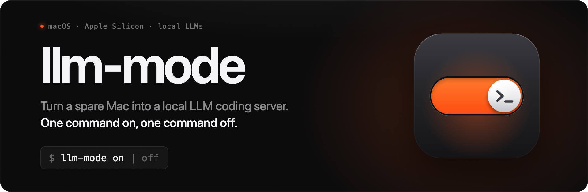
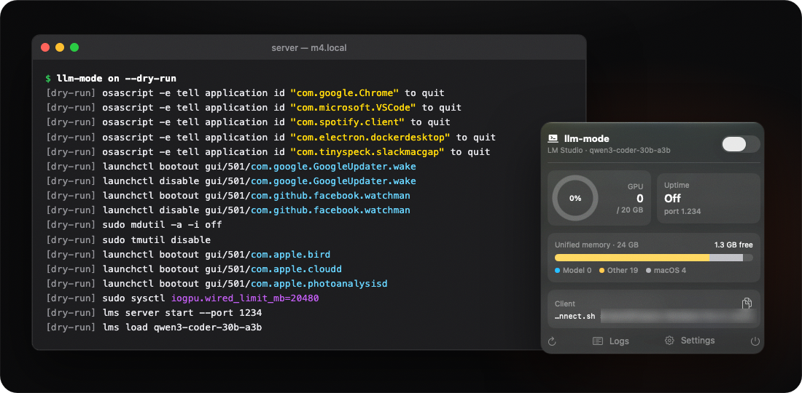
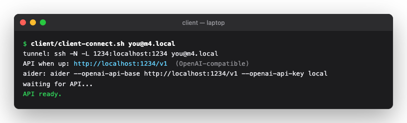
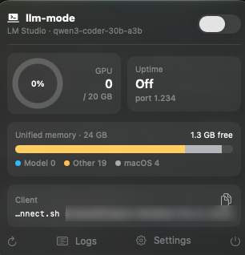
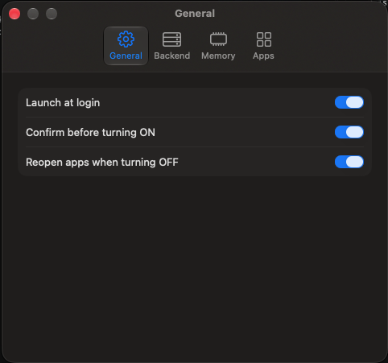
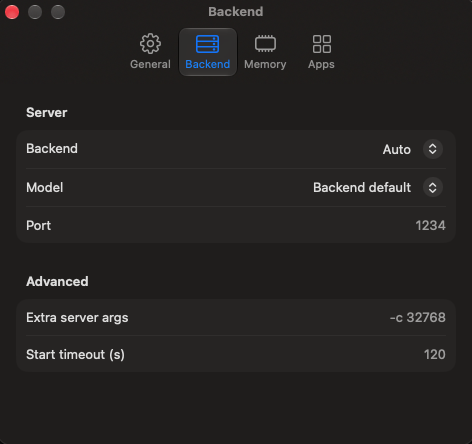
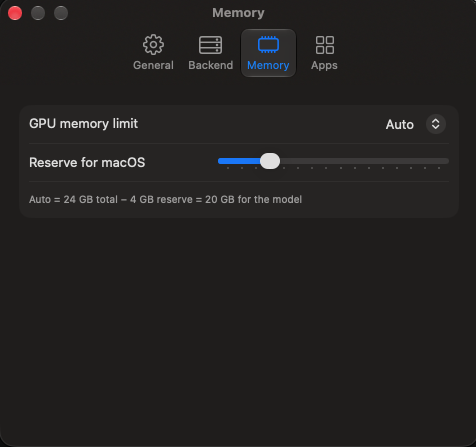
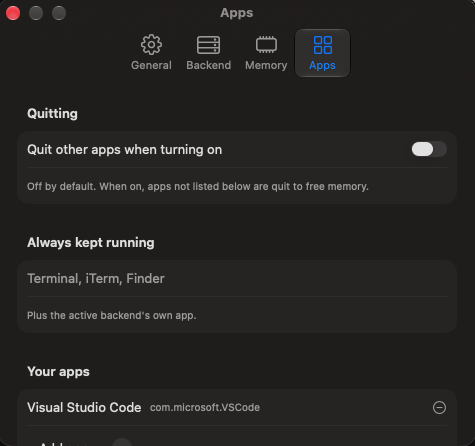

<div align="center">



<br>

Parks background services, raises the GPU memory limit and starts LM Studio, Ollama, llama.cpp or MLX,<br>
then serves the model to your laptop over SSH. `llm-mode off` puts everything back.


[Quick start](#quick-start) · [How it works](#what-on-does) · [Menu bar app](#menu-bar-app) · [Backends](#backends) · [Safety](#safety) · [Configuration](#configuration)

<!-- Read the story: [TITLE](MEDIUM_URL) -->



</div>

## Quick start

On the **server** Mac (the one with the RAM):

```bash
git clone https://github.com/steppannws/llm-mode.git && cd llm-mode
./install.sh              # CLI + scoped sudo + Remote Login; asks for your password once
llm-mode on --dry-run     # see exactly what it would touch
llm-mode on               # free memory, start the server, load the model
```

On your **laptop**:

```bash
client/client-connect.sh you@server.local    # SSH tunnel → http://localhost:1234/v1
```

Point Zed, Continue, Cline or aider at `http://localhost:1234/v1`. When you're done, `llm-mode off` on the server.

## Why

A 24 GB MacBook can run a 30B coding model, but only just. A 4-bit
`qwen3-coder-30b-a3b` needs about 17 GB of unified memory that the GPU can wire.
On a normal working day that memory is already taken by Chrome, Slack, Docker,
Spotlight indexing and a dozen updaters. macOS also caps how much memory the GPU
may wire, and on a machine this size the default cap is below what the model needs.

You can free all of that by hand: quit apps, `launchctl bootout` a few agents,
turn off Spotlight and Time Machine, `sysctl` the GPU limit, start the server,
load the model. Then you have to remember every step so you can undo it.

`llm-mode on` does all of that and writes down what it changed. `llm-mode off`
reads those notes back and undoes each step.

```
┌──────────── laptop ────────────┐           ┌────────── server Mac ──────────┐
│ Zed / Continue / Cline / aider │           │  llm-mode on                   │
│   → http://localhost:1234/v1   │── ssh -L ─│  LLM server → localhost:1234   │
└────────────────────────────────┘           └────────────────────────────────┘
```

## What `on` does

| # | Step | How |
|---|------|-----|
| 1 | **Snapshot** | Running GUI apps, enabled user launch agents, current `iogpu.wired_limit_mb` and the active backend go to `~/.llm-mode/state.json`, *before anything changes* |
| 2 | **Quit apps** | Off by default. With `CFG_QUIT_APPS=1`: AppleScript `quit`, then `kill -9` for anything still alive after 10s |
| 3 | **Park agents** | `launchctl bootout` + `disable` user-installed agents (plist in `~/Library/LaunchAgents`) |
| 4 | **Pause services** | Spotlight (`mdutil -a -i off`), Time Machine (`tmutil disable`), `bird` / `cloudd` / `photoanalysisd` |
| 5 | **Raise GPU limit** | `sysctl iogpu.wired_limit_mb=<total RAM − 4 GB>` (20480 on a 24 GB machine); the reserve is configurable |
| 6 | **Serve** | Starts the active [backend](#backends) on `CFG_PORT`, loads the model, then polls `/v1/models` until it responds |

`off` goes through `state.json` in reverse: stops the server it started (even if you changed backend in config since), restores the old
wired limit, re-enables and restarts agents, turns Spotlight and Time Machine back
on, and with `--relaunch` reopens the apps it quit.

> Run `--dry-run` first. It prints every command `on` would execute, so you can
> check what it plans to close before anything is closed.

<div align="center">

</div>

> On the laptop, one script opens the tunnel and waits until the API responds.
> Editors then use `localhost:1234` as if the model were running on the laptop.

## Menu bar app



The app has no Dock icon, just a laptop icon in the menu bar. The icon is filled when the
server is up. It calls `/usr/local/bin/llm-mode`, so install the CLI first.

Click it for a live panel: GPU memory in use against the wired limit, uptime, a
unified-memory bar (model / other apps / macOS reserve), and the command to
connect from your laptop. The header switch turns LLM Mode on or off. If
`CFG_QUIT_APPS` is on, turning it on first lists the apps that will quit;
otherwise it starts directly. ⚙︎ opens Settings (General, Backend, Memory,
Apps), which edits `~/.llm-mode/config` for you.

Download the signed build from [Releases](https://github.com/steppannws/llm-mode/releases/latest),
or build it from source (below).

<br clear="right">

<details>
<summary><b>Settings window</b> (General, Backend, Memory, Apps)</summary>

<table>
  <tr>
    <td></td>
    <td></td>
  </tr>
  <tr>
    <td></td>
    <td></td>
  </tr>
</table>

</details>

<details>
<summary><b>Build from source, tests and signed releases</b></summary>

```bash
cd app && xcodegen && xcodebuild -scheme LLMMode -configuration Release build
```

`LLMMode.xcodeproj` is generated and git-ignored, so `xcodegen` is required.
The app's Swift unit tests run with:

    cd app && xcodegen && xcodebuild test -scheme LLMMode -destination 'platform=macOS'

**Signed release build** (maintainers): needs a *Developer ID Application*
certificate in the keychain and a stored notarytool profile:

```bash
xcrun notarytool store-credentials llm-mode-notary --apple-id <you> --team-id <TEAMID>
scripts/release.sh                  # build, sign, notarize, staple → build/LLMMode-<version>.zip
scripts/release.sh --no-notarize    # build + sign only
```

</details>

## Backends

llm-mode doesn't serve models itself. It starts one of these servers and makes
sure it has the memory it needs. All of them expose the same OpenAI-compatible
API on `CFG_PORT`, so clients don't care which one runs.

| `CFG_BACKEND` | Server | Default model | Started with |
|---|---|---|---|
| `lmstudio` | [LM Studio](https://lmstudio.ai) (`lms`) | `qwen3-coder-30b-a3b` | `lms server start` + `lms load` |
| `ollama` | [Ollama](https://ollama.com) | `qwen3-coder:30b` | `ollama serve`, then `ollama pull` + preload |
| `llamacpp` | [llama.cpp](https://github.com/ggml-org/llama.cpp) (`llama-server`) | `unsloth/Qwen3-Coder-30B-A3B-Instruct-GGUF:Q4_K_M` | `llama-server -hf <repo>` (or `-m <file>.gguf`) |
| `mlx` | [MLX LM](https://github.com/ml-explore/mlx-lm) (`mlx_lm.server`) | `mlx-community/Qwen3-Coder-30B-A3B-Instruct-4bit` | `mlx_lm.server --model <repo>` |
| `custom` | anything OpenAI-compatible | — | `CFG_SERVER_CMD` |

With the default `CFG_BACKEND=auto`, llm-mode uses the first one installed, in
the order above. Besides your `PATH`, it looks in `/opt/homebrew/bin`,
`/usr/local/bin`, `~/.lmstudio/bin` and `~/.local/bin`, so the menu bar app finds
the same servers as your shell. Set `CFG_MODEL` to use a different model with
whichever backend is active.

Ollama, llama.cpp, MLX and custom servers run in the background under llm-mode.
Their output goes to `~/.llm-mode/server.log` and their pid to `~/.llm-mode/server.pid`.
The first start of llama.cpp or MLX downloads the model, so it can take a while;
raise `CFG_START_TIMEOUT` if needed.

Anything else (vLLM, koboldcpp, …) works as `custom`. `CFG_SERVER_CMD` must be a
single command that serves `/v1` on `CFG_PORT`:

```bash
# ~/.llm-mode/config
CFG_BACKEND=custom
CFG_SERVER_CMD='vllm serve Qwen/Qwen3-Coder-30B-A3B-Instruct --host 127.0.0.1 --port 1234'
CFG_MODEL=Qwen3-Coder-30B   # label shown in status
```

## Safety

The tool disables system services (and quits apps with `CFG_QUIT_APPS=1`), so most of the design is about
being able to undo that:

- **State is written before any change.** If `on` is interrupted halfway, `off`
  can still restore. If something is still wrong, a reboot resets it.
- **`on` never overwrites real state.** Running it twice keeps the first
  snapshot. To take a new one, run `off` and then `on`. The only state it replaces
  is a snapshot from `--dry-run`, which is tagged `"dry_run": true`.
- **Every restore step runs on its own.** If one step fails (for example `sudo`
  with no TTY when triggered from the menu bar), `off` logs it and continues. It
  prints `restored.` or `restored with N failed steps (see log)`.
- **It only disables agents it can re-enable.** That means agents with a plist in
  `~/Library/LaunchAgents`. Apple's own GUI agents are left alone. An early version
  did disable them and `off` couldn't bring them back.
- **sudo is limited to five commands.** `install.sh` grants `NOPASSWD` for exactly
  `sysctl iogpu.wired_limit_mb=*`, `mdutil -a -i off|on`, `tmutil disable|enable`.
  The grant is checked with `visudo -c -f` before it's copied into `/etc/sudoers.d/`.
- **The API is never exposed on the LAN.** Every backend is bound to localhost. The
  client reaches it over SSH, so the only open port is port 22.
- **It won't start on a busy port.** If something already listens on `CFG_PORT`,
  `on` stops before changing anything, so the health check can't mistake another
  process for your model.

### Whitelist

`on` never touches `sshd`, `loginwindow`, `WindowServer`, `mDNSResponder`,
`notifyd`, `cfprefsd`, `systemstats`, `powerd`, `configd`, `distnoted`, Finder,
or `Terminal` / `iTerm`. LM Studio is also kept when it's the active backend; with
any other backend it gets quit like other apps when `CFG_QUIT_APPS=1`, so its memory is freed. Add your own
with `CFG_WHITELIST_EXTRA` in `config` (see [Configuration](#configuration)).

> [!WARNING]
> Only applies with `CFG_QUIT_APPS=1`. **Run it from Terminal.app, iTerm2, or over SSH.** Other terminals (VS Code's
> integrated terminal, Warp, Ghostty, kitty…) are not whitelisted. `on` will quit
> them like any other app, and the shell that ran the command goes with them. To use one
> of them, add it to `CFG_WHITELIST_EXTRA`.

## Requirements

- macOS 14+ on Apple Silicon (the server Mac)
- One LLM server on `PATH`: [LM Studio](https://lmstudio.ai) (`lms`), [Ollama](https://ollama.com),
  [llama.cpp](https://github.com/ggml-org/llama.cpp) (`llama-server`), or [MLX LM](https://github.com/ml-explore/mlx-lm)
  (`mlx_lm.server`). See [Backends](#backends).
- A second machine with `ssh` as the client: macOS, Linux, or Windows 10+
- `bats-core` to run tests, `xcodegen` to build the menu bar app

## Install

On the **server** Mac:

```bash
git clone https://github.com/steppannws/llm-mode.git && cd llm-mode
./install.sh --dry-run   # preview
./install.sh             # prompts for your sudo password once
```

`install.sh` does three things:

- symlinks `bin/llm-mode` → `/usr/local/bin/llm-mode`
- installs the scoped sudoers grant at `/etc/sudoers.d/llm-mode`, validated first
- enables Remote Login (`systemsetup -setremotelogin on`) so the client can SSH in

Optional: get the menu bar app from [Releases](https://github.com/steppannws/llm-mode/releases/latest).
Unzip it and move `LLMMode.app` to `/Applications`. It's signed and notarized, so it opens
without Gatekeeper warnings.

## Usage

### Server

```
llm-mode {on|off|status|serve-stop} [--dry-run] [--relaunch]
```

| Command | Does |
|---|---|
| `on` | Snapshot, free memory, raise GPU limit, start server, load model. Prints free RAM before/after and an API health check. |
| `off` | Restore everything from `state.json`, best-effort. Add `--relaunch` to reopen the apps it quit. |
| `status` | Backend, model, port, wired limit, server up/down, LAN hostname, free RAM (free + speculative + inactive pages). |
| `serve-stop` | Stop only the LLM server. Nothing else is touched. |
| `--dry-run` | Print every action instead of running it. |

### Client

```bash
client/client-connect.sh you@server.local [port]          # macOS / Linux
```

```powershell
.\client\client-connect.ps1 you@server.local [port]       # Windows (PowerShell)
```

Or set `LLM_HOST` / `LLM_PORT`. The script opens `ssh -N -L 1234:localhost:1234`,
waits until `/v1/models` responds, and keeps the tunnel open until you press
Ctrl-C. It exits early if `ssh` fails.

- **Linux:** `server.local` names need mDNS (`avahi-daemon` + `nss-mdns`), or use the server's IP.
- **Windows:** uses the built-in OpenSSH client (Settings → Apps → Optional features → OpenSSH Client).
  If script execution is blocked, run `powershell -ExecutionPolicy Bypass -File client\client-connect.ps1 ...`. Then point any OpenAI-compatible client at `http://localhost:1234/v1`
(the API key can be anything, e.g. `local`):

- **Continue / Cline:** API base URL `http://localhost:1234/v1`
- **Zed:** custom OpenAI-compatible provider, base URL `http://localhost:1234/v1`
- **aider:** `aider --openai-api-base http://localhost:1234/v1 --openai-api-key local`

## Configuration

Everything lives in `~/.llm-mode/`:

| File | Purpose |
|---|---|
| `config` | Optional overrides, sourced as shell |
| `state.json` | Snapshot written by `on`, consumed and deleted by `off` |
| `log` | Append-only, timestamped record of every command run |
| `server.log` / `server.pid` | Output and pid of a backend llm-mode runs in the background |

```bash
# ~/.llm-mode/config (defaults shown)
CFG_BACKEND=auto       # auto | lmstudio | ollama | llamacpp | mlx | custom
CFG_MODEL=             # empty = the backend's default (see Backends)
CFG_PORT=1234
CFG_RESERVE_MB=4096    # RAM left for macOS; wired limit = total RAM - this
CFG_WIRED_MB=          # set to pin an exact wired limit instead
CFG_QUIT_APPS=0        # 1 = quit visible apps on `on` (default leaves them running)
CFG_WHITELIST_EXTRA=   # extra regex, e.g. 'Ghostty|com\.mitchellh\.ghostty'
CFG_SERVER_ARGS=       # extra flags for llama.cpp / MLX, e.g. '-c 32768'
CFG_SERVER_CMD=        # custom backend only
CFG_SERVER_STOP_CMD=   # custom backend only, optional (default: kill the pid)
CFG_START_TIMEOUT=120  # seconds to wait for the API after start
```

**Model storage:** models live wherever your backend stores them (LM Studio's
models folder, `~/.ollama`, the Hugging Face cache for llama.cpp `-hf` and MLX). If that's an
external drive, format it **APFS or exFAT**. FAT32's 4 GB file limit blocks
most quantized models.

## Architecture

```
bin/llm-mode              The CLI. All logic lives here, including one adapter per backend, and it works the same over SSH.
client/client-connect.sh  Opens the tunnel from a macOS/Linux client.
client/client-connect.ps1 Same for Windows (PowerShell + built-in OpenSSH).
app/                      SwiftUI MenuBarExtra. Runs the CLI in the background, has no logic of its own.
install.sh                Symlink + scoped sudoers + Remote Login.
tests/                    bats suite, each test gets its own temp state dir.
```

All logic is in one bash file. Anything the menu bar can do also works from an
SSH session on your phone, and the Swift app has nothing of its own to test.

## Testing

```bash
bats tests/   # 84 tests; changes to the system only ever run as --dry-run
```

[`docs/manual-tests.md`](docs/manual-tests.md) lists the checks that need two real
Macs: RAM actually freed, agents actually restored, reboot mid-`on`, SSH-only
session. The automated suite can't safely run these.

## License

[MIT](LICENSE). Use it, modify it, ship it in your own projects, commercial or not. Just keep the copyright notice.
